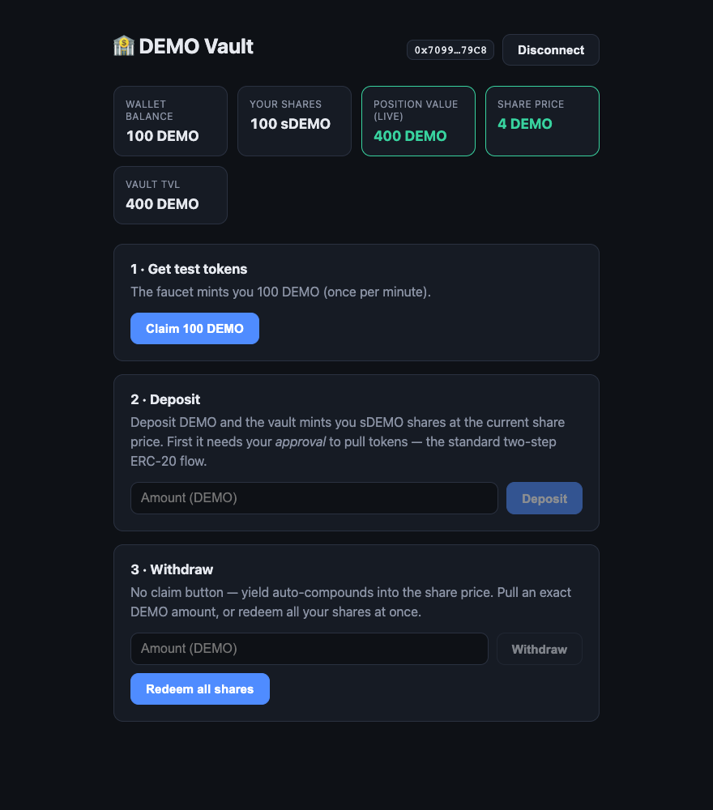

# 🏦 My First DApp — DEMO Vault (ERC-4626)

A minimal but complete DeFi dapp: an ERC-20 token with a faucet, an
**ERC-4626 tokenized yield vault** whose share price appreciates every
second, and a React frontend with wallet connection. Built with
**Foundry** (contracts) and **React + wagmi + viem** (frontend), running
on a local **Anvil** chain.



```
my-first-dapp/
├── contracts/            Foundry project
│   ├── src/DemoToken.sol       ERC-20 + public faucet + gated mint
│   ├── src/DemoVault.sol       ERC-4626 yield vault (sDEMO shares)
│   ├── test/DemoVault.t.sol    10 passing tests (incl. fuzz)
│   └── script/Deploy.s.sol     Deploys + wires mint rights + sets yield
└── frontend/             Vite + React + TypeScript
    ├── src/wagmi.ts            Chain + wallet connector config
    ├── src/contracts.ts        Addresses + ABIs
    └── src/App.tsx             Connect / faucet / deposit / redeem UI
```

---

## How a dapp fits together (the 2-minute explanation)

```
 ┌──────────────┐   signs txs    ┌──────────────┐    JSON-RPC     ┌─────────────┐
 │   React UI   │ ─────────────▶ │    Wallet    │ ──────────────▶ │  Ethereum   │
 │ (wagmi/viem) │                │  (MetaMask)  │                 │ node (Anvil)│
 └──────────────┘                └──────────────┘                 └─────────────┘
        │                                                                │
        └────────── free view reads (balanceOf, convertToAssets) ───────┘
```

1. **Smart contracts** are the backend. They hold all state (balances,
   shares, yield) and enforce all rules. Once deployed, the code is
   immutable — no server, no database.
2. **The wallet** is the user's identity + signer. The frontend never
   touches private keys; it *asks* the wallet to sign transactions, and
   the user approves each one in a popup.
3. **The frontend** is just a view layer. It does two kinds of calls:
   - **Reads** (`balanceOf`, `convertToAssets`) — free, instant, no signature.
   - **Writes** (`deposit`, `redeem`) — real transactions that cost gas
     and need a wallet signature.
4. **The ABI** is the bridge: a JSON description of the contract's
   functions that lets the frontend encode calls correctly.

### The DeFi part: how an ERC-4626 vault works

ERC-4626 is **the standard interface for yield vaults** — Yearn, Aave
wrapped tokens, Lido wrappers, and countless others speak it. The core
mental model is *shares vs assets*:

```
share price = totalAssets() / totalSupply()

deposit:  give assets  → mint  shares = assets / sharePrice
redeem:   burn shares  → get   assets = shares × sharePrice
```

- You deposit DEMO (the **asset**) and receive sDEMO (the **shares** —
  themselves an ERC-20 you could transfer or trade).
- Yield streams into the vault at 1 DEMO/second, so `totalAssets()`
  grows while `totalSupply()` of shares doesn't → **the share price
  only goes up**.
- **There is no claim button.** Your yield auto-compounds into the share
  price; you realize it when you redeem. That's the big UX difference
  from claim-style staking.

Implementation details worth showing off:

- `totalAssets()` is overridden to include *pending* (not-yet-minted)
  yield, so free view calls — and the frontend — see the share price
  tick up live. State-changing calls mint the pending yield first, so
  `previewRedeem` always equals what `redeem` actually pays (tested).
- **No yield accrues while the vault is empty** — otherwise the first
  depositor would capture the entire idle backlog (tested).
- `_decimalsOffset() = 3` enables OZ v5's virtual-share defense against
  the classic **first-depositor share-price inflation attack**. Side
  effect: sDEMO has 21 decimals, which the frontend formats correctly.
- Plus the standard patterns: `approve → deposit` ERC-20 flow, faucet
  rate-limiting, `onlyOwner` / minter-gated access control.

---

## Running the demo (3 terminals)

### Terminal 1 — local chain
```bash
anvil
```
Anvil prints 10 funded accounts. It's a personal Ethereum node with
instant blocks — perfect for demos.

### Terminal 2 — deploy contracts
```bash
cd contracts
forge script script/Deploy.s.sol \
  --rpc-url http://127.0.0.1:8545 \
  --private-key 0xac0974bec39a17e36ba4a6b4d238ff944bacb478cbed5efcae784d7bf4f2ff80 \
  --broadcast
```
(That key is Anvil's well-known default account #0 — never use it anywhere real.)

Deploys are deterministic on a fresh Anvil node, and the frontend already
has these addresses baked in:
- `DemoToken`: `0x5FbDB2315678afecb367f032d93F642f64180aa3`
- `DemoVault`: `0xe7f1725E7734CE288F8367e1Bb143E90bb3F0512`

### Terminal 3 — frontend
```bash
cd frontend
npm run dev
```
Open http://localhost:5173.

### MetaMask setup (one-time)
1. Add network → **chain ID `31337`**, RPC `http://127.0.0.1:8545`,
   currency `ETH`, name "Anvil".
2. Import an account with private key
   `0x59c6995e998f97a5a0044966f0945389dc9e86dae88c7a8412f4603b6b78690d`
   (Anvil account #1 — pre-funded with 10,000 test ETH).
3. ⚠️ If you restart Anvil, MetaMask caches the old nonce. Fix:
   Settings → Advanced → **Clear activity tab data**.

---

## Suggested demo script for the call (~10 min)

1. **Show `DemoToken.sol`** (~45 lines): "an ERC-20 is ~5 lines with
   OpenZeppelin; the rest is our faucet with a cooldown and a gated
   `mint` for the vault's yield."
2. **Show `DemoVault.sol`**: "the entire vault standard comes from
   inheriting `ERC4626` — we override ONE view, `totalAssets()`, and the
   whole share-price machinery follows." Walk the shares-vs-assets
   formula, then point at `_decimalsOffset()` and explain the
   first-depositor inflation attack in one sentence.
3. **Run `forge test -vv`**: point at `test_SharePriceGrowsWithYield`
   ("we time-travel with `vm.warp`; 100 deposited becomes 200
   redeemable") and `test_NoYieldAccruesWhileVaultIsEmpty`.
4. **Deploy live** (Terminal 2) — show the deterministic addresses.
5. **Open the frontend**: connect MetaMask → claim faucet → approve →
   deposit 100 DEMO → watch **Position value** and **Share price** tick
   up live → "note there's no claim button, yield compounds into the
   price" → Redeem all → show the wallet got principal + yield back.
6. **Close**: "because it's standard ERC-4626, any protocol or frontend
   that speaks 4626 could integrate this vault — and the same code
   deploys to a public testnet by changing one `--rpc-url` flag."

## Useful commands

```bash
cd contracts
forge test -vv            # run the test suite
forge test --gas-report   # gas usage per function
forge coverage            # test coverage

# poke the chain directly
cast call 0xe7f1725E7734CE288F8367e1Bb143E90bb3F0512 "totalAssets()(uint256)" --rpc-url http://127.0.0.1:8545
cast rpc evm_increaseTime 3600 --rpc-url http://127.0.0.1:8545   # time-travel 1h
cast rpc evm_mine --rpc-url http://127.0.0.1:8545
```

## Going further

- **Public testnet**: deploy to Sepolia with `--rpc-url $SEPOLIA_RPC
  --verify`, update the two addresses in `frontend/src/contracts.ts`,
  and add `sepolia` to `wagmi.ts` chains.
- **Real ABIs**: import from Foundry's `out/*.json` instead of
  hand-writing them.
- **Real yield**: replace the simulated mint with an actual strategy
  (lend the assets out, LP them) — the 4626 interface stays identical.
- **Better wallet UX**: swap the raw `injected()` connector for
  RainbowKit or ConnectKit.
